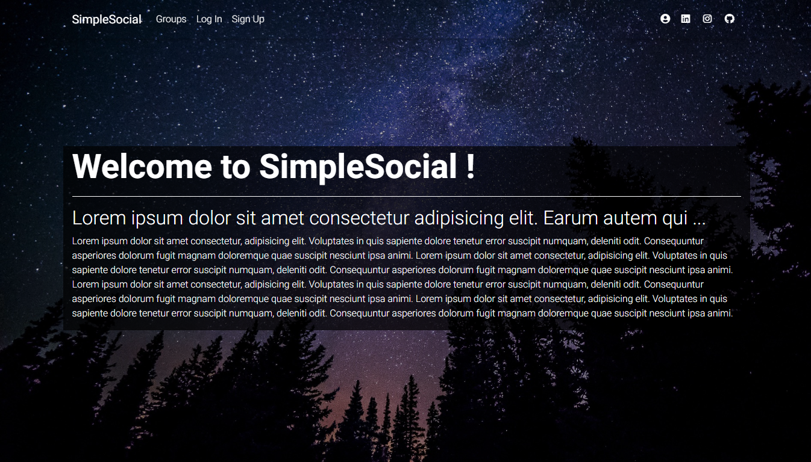
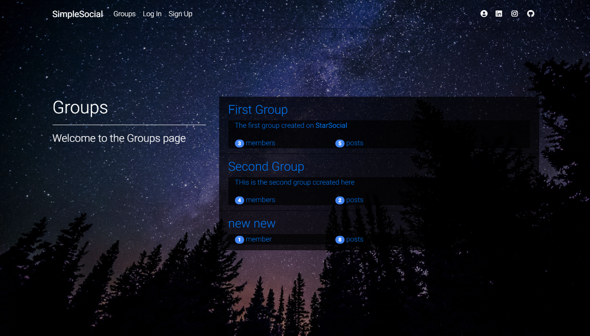
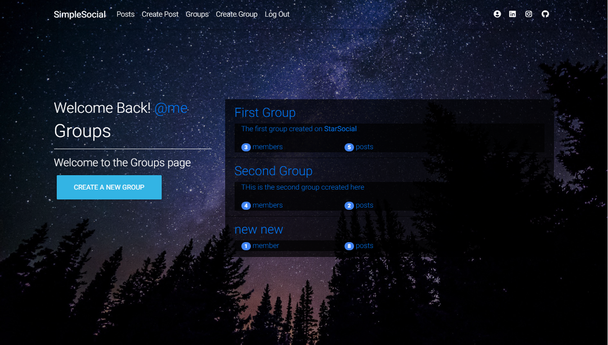
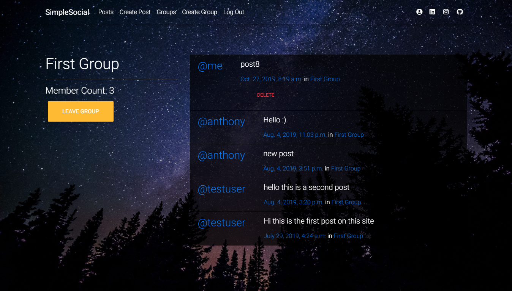
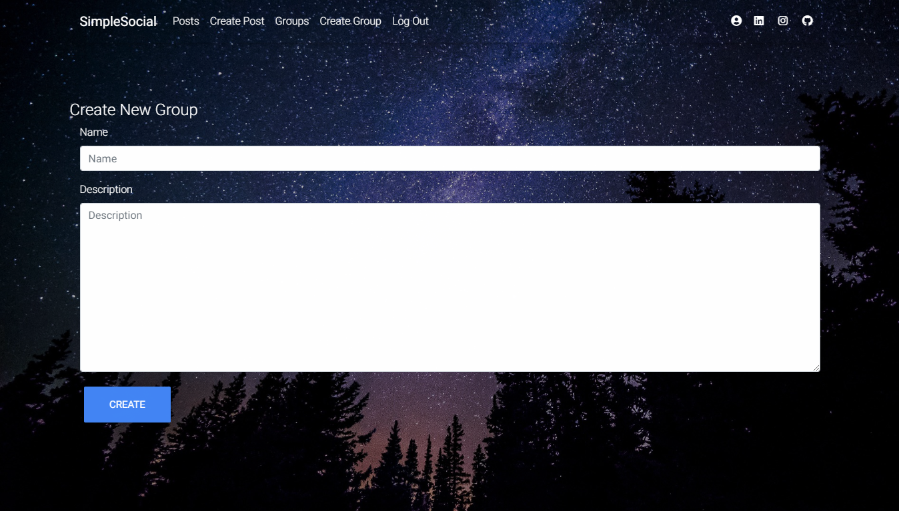
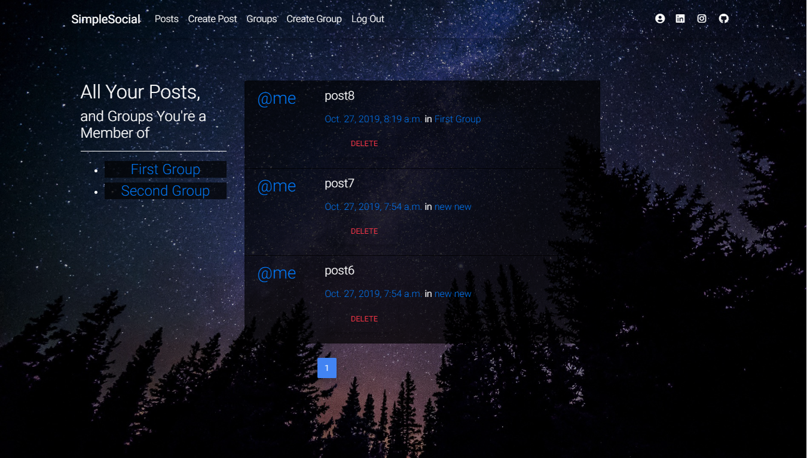
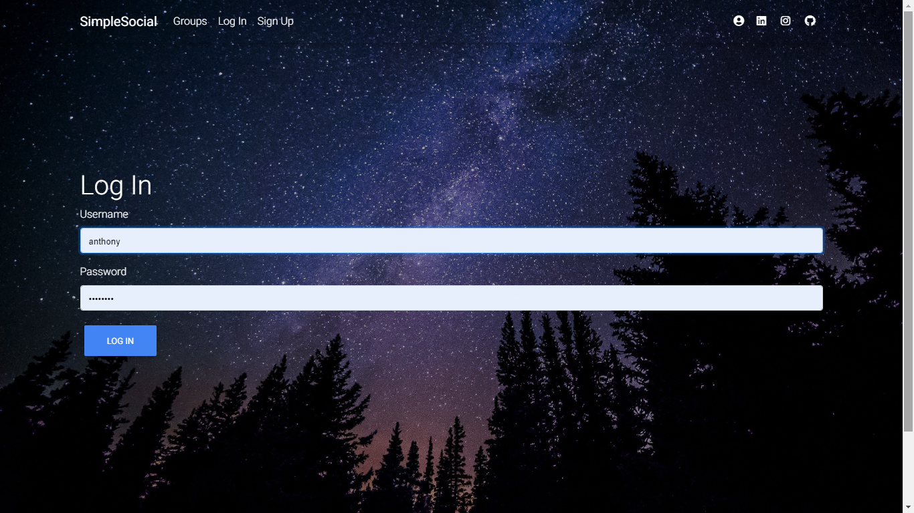
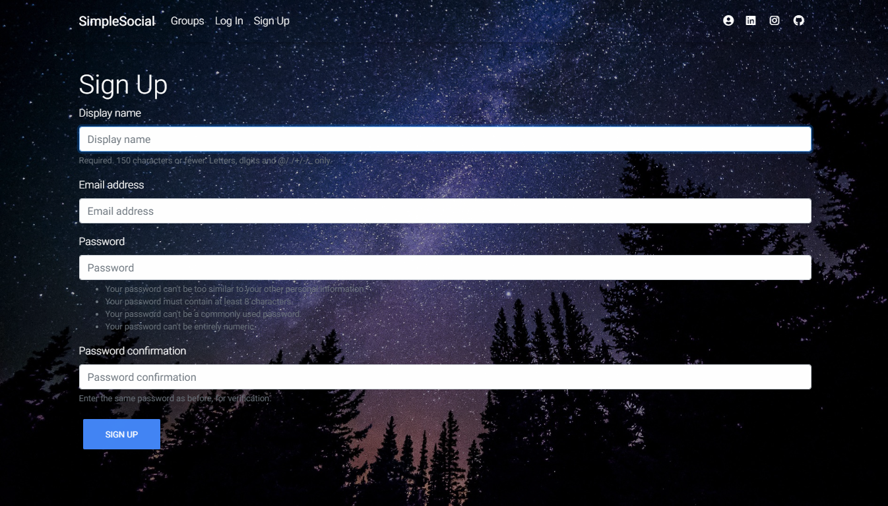

# SimpleSocial 
 A social network built upon a Pierian Data tutorial

The requirements listed are the ones I used at the time. Update the dependencies to prevent vulnerabilities
#
## Some of the Technologies used are:
* Python
* Django
* HTML/CSS/JS
* MDBootstrap

#
Home

Groups

Groups2

Group

Groups

New Group

New Post

Posts

Log in

Sign up

